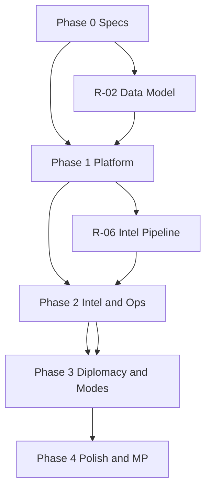

# PRISMA Command Center — Development Plan

> **Status — July 2026:** this is the original planning snapshot. The repository
> now contains a working Next.js/FastAPI implementation, database migrations,
> and automated tests. Treat completed implementation details here as historical
> context; use the source code and `README.md` for the current runtime state.

This document is the authoritative implementation roadmap. It is derived from `/docs` and `/rules/prisma.mdc`.

---

## Project Analysis

### What PRISMA Is

A browser-based strategic command center simulator (year 2035). The player is Director of PRISMA, an international operations center. Gameplay centers on **intelligence, uncertainty, planning, operations, and diplomacy** — not direct unit control, RTS mechanics, or arcade action.

### Documented Strengths

| Area | Coverage |
|------|----------|
| Product vision | Clear fantasy, constraints, and anti-patterns (no RTS, no shooters) |
| Tech stack | Frontend, backend, realtime, and deployment choices are fixed |
| Architecture style | Feature-based layout, DDD, service + repository layers |
| Core domains | Six systems named with high-level behaviors |
| UI shell | Command Center layout, secondary screens, visual tone |
| World setting | Three blocs, faction strengths, instability theme |
| Data nouns | Entity list provides a starting domain vocabulary |

### Current State

- **Code:** None
- **Infrastructure:** None (Docker mentioned in architecture only)
- **Specs:** No API contracts, schemas, game formulas, or acceptance criteria
- **Prior plan:** Four coarse phases with checkbox items only

### Architectural Implications (from `architecture.md` + rules)

1. **Split stack:** Next.js client talks to FastAPI; shared contracts must be defined early (OpenAPI + generated types or hand-maintained DTOs).
2. **Async simulation:** Celery + Redis imply long-running world ticks, operation resolution, and event generation off the request path.
3. **Realtime layer:** WebSockets carry live feeds (events, intel, operation status); scope must be explicit to avoid polling everything.
4. **Uncertainty as data:** True world state lives server-side; client receives filtered intelligence — this boundary is the core technical invariant.

---

## Missing Requirements

Items below are **not contradictions** in existing docs — they are **undocumented decisions** required before or during implementation. Resolve each in a short spec (new doc or section) before building the dependent feature.

### P0 — Blocking (must spec before Phase 1 code)

| ID | Gap | Why it matters |
|----|-----|----------------|
| R-01 | **Simulation time model** | `WorldTick` exists as a noun; no tick interval, pause, speed (1×–8×), or what advances on tick vs on demand |
| R-02 | **Entity schema** | `database.md` lists entities only — no fields, relationships, indexes, or lifecycle (created/updated/archived) |
| R-03 | **Auth model** | Authentication is a Phase 1 task with no strategy (sessions vs JWT), registration, roles, or multi-game ownership |
| R-04 | **Game session model** | No definition of campaign save, active world instance, or player ↔ world binding |
| R-05 | **API surface** | No REST resource map, WebSocket event catalog, versioning, or error envelope |
| R-06 | **True state vs intel pipeline** | Core fantasy requires server-side truth and client-side filtered reports — pipeline stages undefined |
| R-07 | **Geographic data** | Map (Leaflet) needs Region/City/Country geometry source, projection, and update rules |
| R-08 | **Resource economy** | Operations “consume resources” — resource types, caps, regeneration, and costs unspecified |
| R-09 | **Repository layout** | Feature-based monorepo vs polyrepo, package naming, and shared-types location unspecified |

### P1 — High (spec during Phase 1–2)

| ID | Gap | Why it matters |
|----|-----|----------------|
| R-10 | **Intelligence mechanics** | Per-source (SATINT/SIGINT/HUMINT/CYBER) behavior, collection tasks, confidence formula, staleness |
| R-11 | **Report object model** | Required fields listed loosely; no templates, attachments, classification, or deduplication |
| R-12 | **Analyst model** | Bias dimensions, skills, assignment, workload, and how they alter confidence/interpretation |
| R-13 | **Asset model** | Types beyond examples, availability states, damage/recovery, assignment to ops/intel |
| R-14 | **Operation lifecycle** | States (planned → active → resolved), duration, prerequisites, failure modes, `OperationResult` shape |
| R-15 | **Event engine** | Triggers, weights, chains, cooldowns, visibility rules, and link to diplomacy/world state |
| R-16 | **Diplomacy mechanics** | `DiplomaticRelation` scale, player actions, AI reactions, and tie-in to events/operations |
| R-17 | **Country / bloc AI** | How Nordex, Aster, Consortium and neutrals behave between player actions |
| R-18 | **Redis usage** | Cache vs pub/sub vs Celery broker — architecture lists Redis but not roles |
| R-19 | **Celery task catalog** | Which workloads are async (tick, op resolution, intel generation, notifications) |
| R-20 | **WebSocket subscription model** | Channels per game, per user, auth on connect, reconnect/backfill |

### P2 — Medium (spec before Phase 3–4)

| ID | Gap | Why it matters |
|----|-----|----------------|
| R-21 | **Campaign Mode** | Listed in Phase 3 only — no scenarios, objectives, length, or win/lose |
| R-22 | **Crisis Mode** | No definition (timed scenario? scripted chain? difficulty?) |
| R-23 | **Progression / metagame** | Unlocks, difficulty, scoring, or replay — absent |
| R-24 | **Multiplayer** | Phase 4 checkbox only — competitive/co-op, sync model, authority |
| R-25 | **Balancing parameters** | Tunables registry (YAML/DB), who edits, environment separation |
| R-26 | **Onboarding / tutorial** | First-run flow for Command Center UI complexity |
| R-27 | **Accessibility & i18n** | Not mentioned; affects UI component choices early |
| R-28 | **Observability** | Logging, tracing, metrics for simulation and Celery |
| R-29 | **Security** | Rate limits, input validation policy, secrets management in Docker |
| R-30 | **Testing strategy** | Unit vs integration vs simulation golden tests — undefined |
| R-31 | **CI/CD** | Beyond Docker Compose: test pipeline, migrations, staging deploy |
| R-32 | **Content pipeline** | How designers add events, countries, scenarios without code deploy |

### Explicit Non-Goals (from rules — do not add without doc change)

- Direct military unit control
- RTS or city-builder loops
- Arcade combat or shooter mechanics
- Sci-fi visual effects (per `ui.md`)

---

## Implementation Roadmap

Phases align with the original four-phase outline but decompose into **epics → deliverables → acceptance criteria**. Dependencies flow top-to-bottom within a phase unless noted.

**Legend:** `[Spec]` = write/update documentation first (no app code). `[Build]` = implementation. `[Ops]` = infrastructure/tooling.

---

## Phase 0 — Foundations (prerequisite to all code)

**Goal:** Decisions and repo skeleton so Phase 1 does not rework structure.

### 0.1 Governance & specs

- [ ] `[Spec]` **R-01** Simulation time model — document tick driver, pause, speed, and what runs per tick
- [ ] `[Spec]` **R-02** Entity-relationship model — fields, FKs, enums for all entities in `database.md`
- [ ] `[Spec]` **R-03** Auth & session — identity provider choice, token/session flow, User lifecycle
- [ ] `[Spec]` **R-04** Game session — world instance, save/load, single-player ownership rules
- [ ] `[Spec]` **R-05** API & WebSocket catalog — OpenAPI draft + event names/payloads
- [ ] `[Spec]` **R-06** Intelligence pipeline — truth → collection → report → analyst → client
- [ ] `[Spec]` **R-07** Geographic data — source files, simplification, Country/Region/City hierarchy
- [ ] `[Spec]` **R-08** Resource economy — types, starting values, operation costs
- [ ] `[Spec]` **R-09** Monorepo layout — `apps/web`, `apps/api`, `packages/shared`, feature folder convention

### 0.2 Tooling & quality gates

- [ ] `[Ops]` Initialize git branching model and PR checklist (references `/docs` + rules)
- [ ] `[Ops]` Docker Compose: PostgreSQL, Redis, API, worker, web (dev)
- [ ] `[Ops]` Environment variable template (`.env.example`) — no secrets committed
- [ ] `[Spec]` **R-30** Testing strategy — pyramid, simulation test harness outline
- [ ] `[Spec]` **R-31** CI pipeline — lint, typecheck, test, migration check on PR

**Phase 0 exit criteria:** OpenAPI v0.1 published; ER diagram agreed; `docker compose up` brings empty DB + health endpoints; no gameplay yet.

---

## Phase 1 — Platform & Living World

**Goal:** Authenticated app shell, persistent world, ticking simulation, and event feed — player can log in and watch a world evolve with placeholder UI.

### 1.1 Project setup

- [ ] `[Build]` Monorepo scaffold per **R-09** (Next.js, FastAPI, shared types)
- [ ] `[Build]` Feature modules: `auth`, `world`, `events`, `game-session` (skeleton only)
- [ ] `[Build]` SQLAlchemy 2 models + Alembic migrations from **R-02**
- [ ] `[Build]` Repository + service layer stubs per architecture.md
- [ ] `[Build]` Tailwind + dark theme tokens aligned with `ui.md`
- [ ] `[Build]` Health/readiness endpoints for API and worker

### 1.2 Authentication

- [ ] `[Build]` User registration/login per **R-03**
- [ ] `[Build]` Protected API routes and WebSocket auth handshake per **R-20** draft
- [ ] `[Build]` Frontend auth flow (login, session persistence, logout)
- [ ] **Acceptance:** Unauthenticated clients cannot read game state or subscribe to feeds

### 1.3 World simulation (core)

- [ ] `[Build]` Seed script: countries, regions, cities, blocs (from `world-lore.md` + **R-07**)
- [ ] `[Build]` `World`, `Country`, `Region`, `City`, `CountryStatus` persistence
- [ ] `[Build]` `WorldTick` scheduler (Celery beat) per **R-01**
- [ ] `[Build]` Baseline country/bloc state machine (minimal AI per **R-17** stub)
- [ ] `[Build]` Redis + Celery wiring per **R-18**, **R-19**
- [ ] **Acceptance:** World advances N ticks in dev; state diffs persisted; worker logs show tick completion

### 1.4 Event engine (v1)

- [ ] `[Spec]` **R-15** Event engine v1 — trigger types, weights, visibility
- [ ] `[Build]` `Event` generation on tick (border conflict, cyber attack, etc. from `game-systems.md`)
- [ ] `[Build]` Event persistence and chronological query API
- [ ] `[Build]` WebSocket push: new events to subscribed clients
- [ ] **Acceptance:** Events appear in DB and on WS within one tick of generation; no duplicate IDs

### 1.5 Command Center shell (read-only v1)

- [ ] `[Build]` Layout per `ui.md`: left Event Feed, center Leaflet map, right panel placeholder, bottom time controls
- [ ] `[Build]` Time controls wired to **R-01** (pause / speed) via API
- [ ] `[Build]` Map layers: countries/regions; no intel fog yet
- [ ] `[Build]` React Query for REST; Zustand for UI-only state; WS hook for events
- [ ] **Acceptance:** Logged-in player sees live event feed and map; time controls affect simulation

**Phase 1 exit criteria:** End-to-end demo — login → world ticks → events on map and feed. Intelligence and operations still stubbed.

---

## Phase 2 — Intelligence & Operations Loop

**Goal:** Player gathers imperfect information, assigns analysts/assets, and queues operations with consequences.

### 2.1 Intelligence system

- [ ] `[Spec]` **R-10**, **R-11** — source behaviors, confidence, staleness, report templates
- [ ] `[Build]` Collection tasks per source (SATINT/SIGINT/HUMINT/CYBER)
- [ ] `[Build]` `IntelligenceReport` generation from true state via **R-06** pipeline
- [ ] `[Build]` Confidence score + timestamp + source on every report
- [ ] `[Build]` Intelligence Center screen (list, filter, detail)
- [ ] `[Build]` Right-panel Intelligence Feed on Command Center
- [ ] **Acceptance:** Reports can be wrong/incomplete; player cannot API-fetch ground truth

### 2.2 Analysts

- [ ] `[Spec]` **R-12** — bias model, skills, assignment rules
- [ ] `[Build]` `Analyst` CRUD (hire/configure within design limits)
- [ ] `[Build]` Assign analysts to reports or queues; interpretation modifies presentation
- [ ] `[Build]` Analyst Dashboard screen
- [ ] `[Build]` Command Center right panel: analyst roster + assignments
- [ ] **Acceptance:** Same raw report differs in summary/confidence band by assigned analyst

### 2.3 Assets

- [ ] `[Spec]` **R-13** — asset types, status transitions, recovery timers
- [ ] `[Build]` `Asset`, `AssetStatus` models and APIs
- [ ] `[Build]` Asset Management screen
- [ ] `[Build]` Availability gates collection and operations
- [ ] **Acceptance:** Damaged/destroyed assets cannot be assigned until recovery rules satisfied

### 2.4 Operations

- [ ] `[Spec]` **R-14** — lifecycle, costs (**R-08**), failure outcomes
- [ ] `[Build]` Operation types: Recon, Strike, Cyber, Special Operation, Influence
- [ ] `[Build]` Operations Planner screen + bottom Operations Queue on Command Center
- [ ] `[Build]` Queue processor (Celery): start, resolve, write `OperationResult`
- [ ] `[Build]` Resource deduction and asset consumption
- [ ] **Acceptance:** Player queues op → waits → receives result; failure possible; resources updated

### 2.5 Map & uncertainty (v1)

- [ ] `[Spec]` Map visualization rules — what player sees without intel vs with intel
- [ ] `[Build]` Map markers/layers driven by reports (not truth)
- [ ] **Acceptance:** Map never renders true enemy positions without corresponding intel

**Phase 2 exit criteria:** Core gameplay loop — intel → analyze → plan operation → wait → read result — playable in single session.

---

## Phase 3 — Diplomacy & Game Modes

**Goal:** Political layer and structured scenarios beyond sandbox tick.

### 3.1 Diplomacy

- [ ] `[Spec]` **R-16** — relation scale, actions, AI reactions
- [ ] `[Build]` `DiplomaticRelation` updates from events and player actions
- [ ] `[Build]` Diplomacy Room screen
- [ ] `[Build]` Country reactions feed into event engine weights
- [ ] **Acceptance:** Player diplomatic action changes relations; countries respond via events or status

### 3.2 World depth

- [ ] `[Build]` Enrich **R-17** country/bloc AI — logistics, cyber, conventional strengths from lore
- [ ] `[Build]` `CountryStatus` visible through intel/diplomacy (not raw truth UI)
- [ ] **Acceptance:** Bloc tendencies observable over many ticks without scripting every outcome

### 3.3 Campaign Mode

- [ ] `[Spec]` **R-21** — scenarios, objectives, fail states, duration
- [ ] `[Build]` Scenario definition format (data-driven per **R-32**)
- [ ] `[Build]` Campaign selection, progression, win/lose evaluation
- [ ] **Acceptance:** At least one playable campaign from start to victory or defeat

### 3.4 Crisis Mode

- [ ] `[Spec]` **R-22** — entry conditions, time pressure, unique events
- [ ] `[Build]` Crisis scenario runner (scripted event chains + heightened tick behavior)
- [ ] **Acceptance:** Crisis completable in one sitting; distinct from sandbox pacing

### 3.5 Game session & persistence

- [ ] `[Build]` Save/load per **R-04** (world + reports + ops queue + relations)
- [ ] `[Build]` Resume campaign/crisis from snapshot
- [ ] **Acceptance:** Refresh browser / re-login restores in-progress game

**Phase 3 exit criteria:** Sandbox plus one campaign and one crisis; diplomacy materially affects play.

---

## Phase 4 — Polish, Balance & Multiplayer

**Goal:** Production quality, tunable balance, optional multiplayer — only after single-player loop is fun.

### 4.1 Balancing & content

- [ ] `[Spec]` **R-25** — parameter registry and change process
- [ ] `[Build]` Externalize weights: event engine, intel confidence, op success, diplomacy
- [ ] `[Build]` **R-32** Content tooling docs (and minimal admin scripts if needed)
- [ ] **Acceptance:** Designer can change event weight without code change

### 4.2 UX polish

- [ ] `[Spec]` **R-26** Onboarding / tutorial flow
- [ ] `[Build]` Loading/error/empty states on all screens from `ui.md`
- [ ] `[Build]` Keyboard navigation and focus order for Command Center
- [ ] `[Spec]` **R-27** — decide i18n scope; implement if required
- [ ] **Acceptance:** New player completes tutorial and first operation without docs

### 4.3 Observability & hardening

- [ ] `[Build]` **R-28** Structured logging, worker monitoring, slow-tick alerts
- [ ] `[Build]` **R-29** Rate limits, security headers, dependency audit in CI
- [ ] **Acceptance:** Staging runs 24h soak test without silent tick failure

### 4.4 Multiplayer (optional / gated)

- [ ] `[Spec]` **R-24** — authority model, sync, conflict resolution
- [ ] `[Build]` Only if spec approved — shared or competitive sessions
- [ ] **Acceptance:** Defined in spec; not started without explicit product sign-off

**Phase 4 exit criteria:** Release candidate — balanced campaign, stable ops, documented deploy, multiplayer optional.

---

## Cross-Cutting Workstreams

Run in parallel with phases above; do not defer entirely to Phase 4.

| Workstream | Tasks | Target phase |
|------------|-------|----------------|
| **Shared contracts** | OpenAPI + TS types; WS payload types | 0–1 |
| **Feature folders** | `intelligence/`, `operations/`, `diplomacy/`, etc. on API and web | 1+ |
| **Simulation tests** | Golden tick fixtures for event/intel/op outcomes | 2+ |
| **Design docs** | Close P0/P1 requirement IDs before building dependent epics | Ongoing |
| **Rule compliance** | PR review: no RTS/unit control; uncertainty preserved | Always |

---

## Suggested Spec Artifacts (documentation backlog)

Create these under `/docs` when closing requirement IDs — **do not implement until the relevant spec exists.**

| Document | Closes |
|----------|--------|
| `simulation-time.md` | R-01, R-19 |
| `data-model.md` | R-02 (extends `database.md`) |
| `auth-and-sessions.md` | R-03, R-04 |
| `api-and-realtime.md` | R-05, R-20 |
| `intelligence-pipeline.md` | R-06, R-10, R-11 |
| `geography-and-map.md` | R-07, map fog rules |
| `economy-and-resources.md` | R-08 |
| `operations-lifecycle.md` | R-14 |
| `event-engine.md` | R-15 |
| `diplomacy-and-ai.md` | R-16, R-17 |
| `campaign-and-crisis.md` | R-21, R-22 |
| `deployment-and-ops.md` | R-28, R-29, R-31 |
| `testing.md` | R-30 |

---

## Dependency Graph (summary)

---

## Immediate Next Actions

1. Complete **Phase 0.1** specs (P0 table) — especially **R-01**, **R-02**, **R-05**, **R-06**.
2. Approve monorepo layout (**R-09**) and add Docker Compose skeleton (**Phase 0.2**).
3. Implement **Phase 1.1** only after Phase 0 exit criteria are met.

---

## Traceability

| Source doc | Roadmap sections |
|------------|------------------|
| `vision.md` | Analysis, non-goals, intel-first loop |
| `architecture.md` | Phase 0–1 stack, workstreams |
| `game-systems.md` | Phases 2–3 epics |
| `ui.md` | Phase 1.5, 2.x screens |
| `database.md` | Phase 0 R-02, entity tasks |
| `world-lore.md` | Phase 1.3 seed, Phase 3.2 AI flavor |
| `rules/prisma.mdc` | Constraints, doc-first discipline |

*Last updated: development plan generated from full `/docs` and `/rules` review.*
